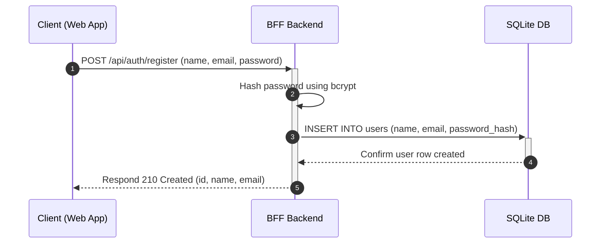
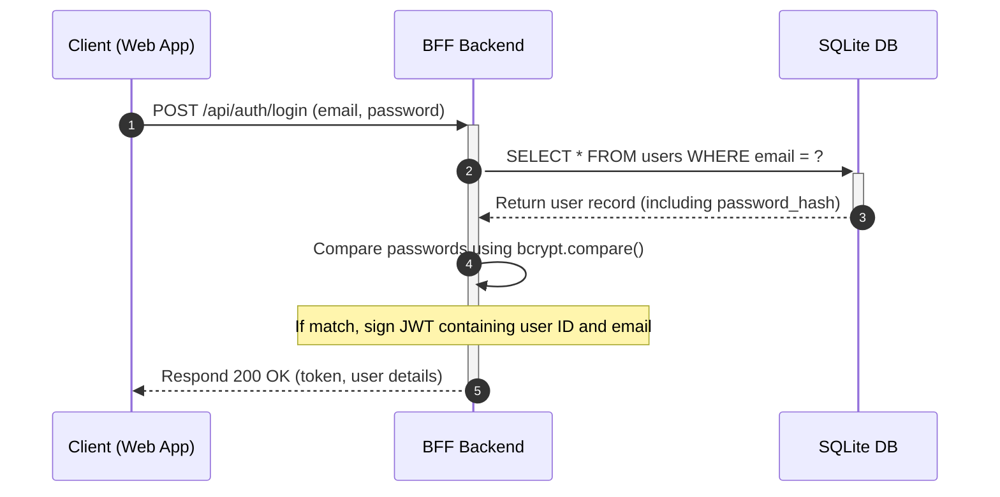
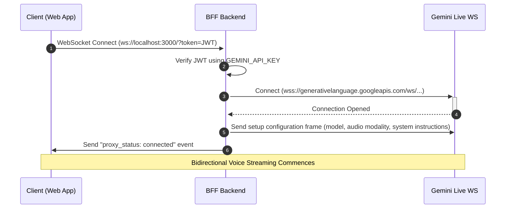
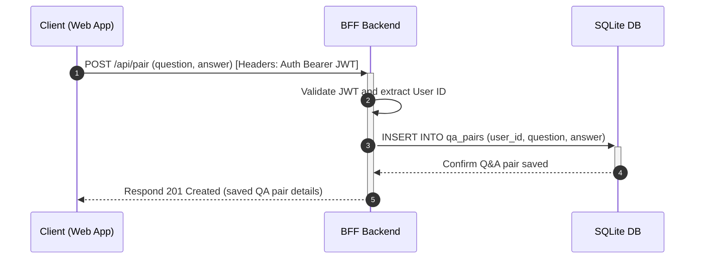

# System Architecture & Lifecycle Flows

This document details the architectural layers and complete application lifecycle flows of the **Interview.ai** system.

---

## 1. Flow: User Creation (Registration)

1. **Submission**: The user fills out the registration form in the web frontend. The client submits a POST request to `/api/auth/register`.
2. **Encryption**: The backend generates a salt and hashes the plaintext password via `bcrypt`.
3. **Storage**: The backend inserts the record containing the name, email, and the generated password hash into the SQLite `users` table.
4. **Response**: On success, the backend sends back the user object (excluding the password hash) with HTTP status `201 Created`.

---

## 2. Flow: Authentication & Login

1. **Submission**: The user enters their email and password. The client posts them to `/api/auth/login`.
2. **Database Lookup**: The backend queries the SQLite database for a user matching the provided email.
3. **Verification**: If found, `bcrypt.compare()` compares the plain text password with the stored password hash.
4. **Token Generation**: If verified, a JSON Web Token (JWT) is signed using the server's private `GEMINI_API_KEY` (which acts as the JWT signing secret, configured with an expiration of 7 days).
5. **Response**: The JWT token and basic user details are returned to the client. The client stores the token in local storage for subsequent requests.

---

## 3. Flow: Voice Session & WebSocket Handshake

1. **Connection**: The client opens a WebSocket connection to the BFF server, appending the user's JWT token as a query parameter (e.g., `?token=JWT_STRING`).
2. **Authentication**: The backend interceptor parses and verifies the token. If invalid, it immediately terminates the websocket handshake.
3. **Upstream connection**: The backend opens an outbound WebSocket connection to the Gemini Live WebSocket endpoint using the stored `GEMINI_API_KEY`.
4. **Configuration**: Once the upstream socket opens, the backend BFF pushes the initial JSON `setup` payload to Gemini, defining the conversation properties, output mode (`AUDIO`), and system prompts.
5. **Session Ready**: The backend emits a `proxy_status: connected` packet back to the frontend. The web app is now ready to record and stream audio.

---

## 4. Flow: Conversation Data Persistence

1. **Pair Collection**: During or after the session, the conversation yields completed QA pairs.
2. **Save Request**: The client issues a POST request to `/api/pair` containing the question and answer text, attaching the JWT in the `Authorization` header.
3. **Database Insertion**: The backend validates the token, extracts the user ID, and saves the QA pair to the `qa_pairs` SQLite table to construct the user's personal knowledge base.
